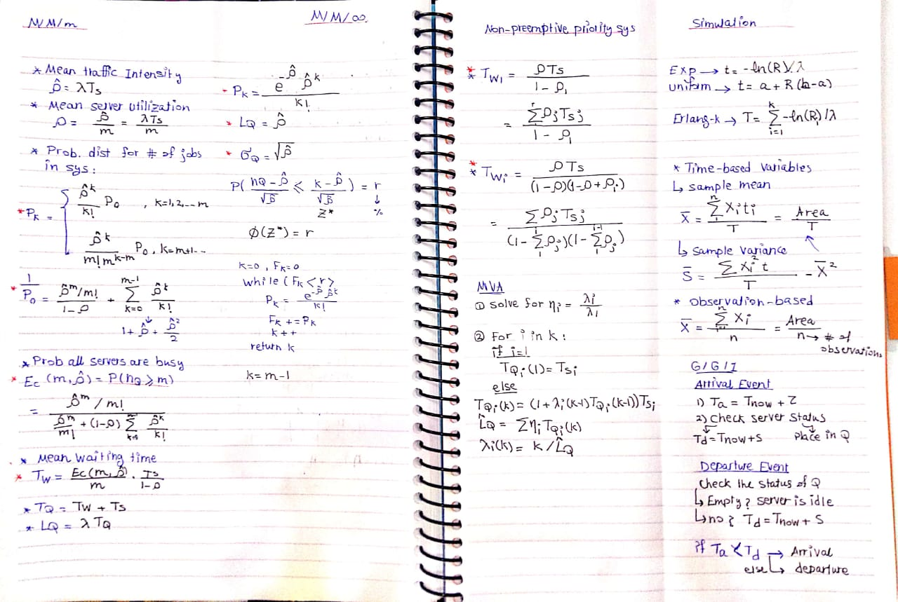

# Performance Evaluation and Queueing Theory

Summary [CC581N] Performance Evaluation course - CCE - 2021 🙌

---

## Contents
* [x] [Rules cheat sheet](#rules-cheat-sheet)
* [x] [Tutorials](#tutorials)
* [x] [Related](#related)

---

## Rules cheat sheet

---

## Tutorials
* [Tutorial_1](Tutorials/performance_sheet_1.pdf)
* [Tutorial_2](Tutorials/performance_tutorial_2.pdf)
* [Tutorial_3](Tutorials/performance_tutorial_3.pdf)
* [Tutorial_4](Tutorials/performance_tutorial_4.jpeg) 👇
  
* [Tutorial_5](Tutorials/performance_tutorial_5.pdf)
  
---

<object data="Tutorials/performance_sheet_1.pdf" type="application/pdf" width="700px" height="700px">
    <embed src="Tutorials/performance_sheet_1.pdf">
        
This browser does not support PDFs.

    </embed>
</object>

---
## Related
✅ Project : [Airport Security Simulation Model - Simulink](https://github.com/Hagar-Usama/Airport-Security-Simulation-Model)

